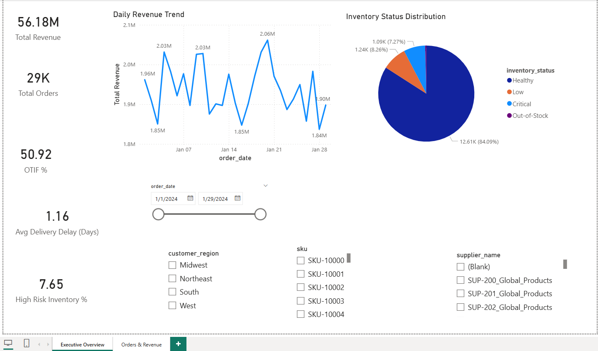
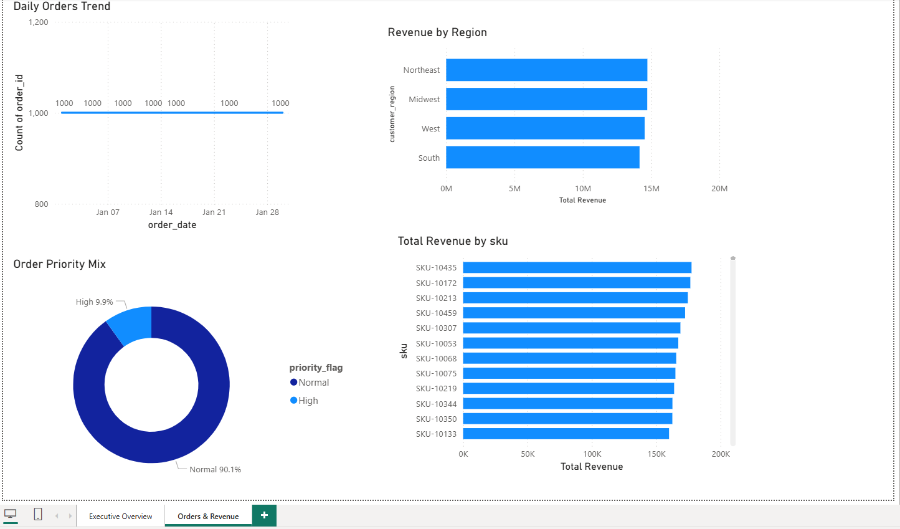

# 📦 Supply Chain Analytics Project (End-to-End)

An end-to-end data analytics solution built for the **Daxwell Data Analyst Assessment**, showcasing skills in:

- **Data Engineering (ETL)**
- **Data Cleaning & Transformation**
- **SQL Modeling**
- **Exploratory Data Analysis (EDA)**
- **Dashboard Development (Power BI)**
- **Supply Chain Insights & KPI Reporting**

This project simulates a real supply-chain environment involving **orders, inventory, shipments, and supplier performance**.

## 🧱 Project Architecture

### 📁 data/
- **raw/** — Raw datasets generated via Python  
- **processed/** — Cleaned datasets produced by the ETL pipeline  
- **dictionary/** — Data dictionary for all columns  

### 📁 pipeline/
- `extract.py` — Reads/generates raw data  
- `transform.py` — Cleans, transforms, creates KPIs  
- `load.py` — Saves processed datasets  
- `run_pipeline.py` — Orchestrates the ETL sequence  
- `config.yaml` — Parameter configuration  

### 📁 sql/
- `01_create_tables.sql` — Table schema setup  
- `02_cleaning_queries.sql` — SQL-level cleaning  
- `03_kpi_queries.sql` — KPI definitions  
- `04_supplier_scorecard.sql` — Supplier scoring logic  
- `05_inventory_performance.sql` — Inventory insights  

### 📁 notebooks/
- `EDA_Inventory.ipynb` — Inventory analysis  
- `EDA_Orders.ipynb` — Order trends & revenue  
- `KPI_Analysis.ipynb` — KPI deep dive  

### 📁 dashboard/powerbi/
- `supply_chain_dashboard.pbix` — Power BI report  
- **screenshots/**  
  - full_executive_overview_page.png  
  - kpi_card_section.png  
  - revenue_trend.png  
  - inventory_status_pie.png  
  - full_orders_revenue_page.png  
  - daily_orders_trend.png  
  - revenue_by_region.png  
  - top_skus_bar.png  

### 📁 visuals/
- **charts_from_notebook/** — All EDA visuals  
- **architecture/** — Mermaid diagrams (optional)  

### 📄 Other Files
- `README.md` — Full project documentation  
- `requirements.txt` — Python dependencies  
- `LICENSE` — MIT license  

# 📦 1. Dataset Overview

The project includes **four primary datasets (10k–50k rows each)**:

## **📌 orders_clean.csv**
Contains order and shipping details:

- order_id, order_date  
- customer_region  
- sku  
- order_value  
- priority_flag  
- shipping_delay_days  
- is_completed, is_cancelled, is_returned  

## **📌 inventory_clean.csv**
SKU-level inventory:

- sku, supplier_id  
- inventory_level  
- reorder_point, reorder_qty  
- lead_time_days  
- inventory_status  

## **📌 shipments_clean.csv**
Shipment performance & delivery reliability:

- order_id  
- shipment_id  
- actual_delivery_date  
- expected_delivery_date  
- delivery_delay_days  
- is_delivered, is_delayed  
- delivered_on_time_flag  
- carrier  

## **📌 suppliers_clean.csv**
Supplier metadata:

- supplier_id  
- supplier_name  
- region  
- reliability_score  
- avg_lead_time_days  

_All raw datasets were generated using Python to simulate realistic supply chain operations._

# ⚙️ 2. ETL Pipeline

The ETL pipeline includes:

### 🔹 **extract.py**
Loads raw CSV files into pandas DataFrames.

### 🔹 **transform.py**
Cleans data and applies transformations:

- Standardizing date formats  
- Deriving KPI flags (OTIF, delay)  
- Inventory risk scoring  
- Feature creation  

### 🔹 **load.py**
Exports cleaned datasets to `/processed`.

### 🔹 **run_pipeline.py**
Runs the full ETL workflow using **config.yaml**.

# 📊 3. Exploratory Data Analysis (EDA)

Performed using **Jupyter notebooks**.

### **📌 EDA_Inventory.ipynb**
- Inventory levels  
- Status distribution  
- Days of cover  
- SKU risk segmentation  

### **📌 EDA_Orders.ipynb**
- Daily order volume  
- Revenue patterns  
- Cancellation trends  
- Region performance  

### **📌 KPI_Analysis.ipynb**
- OTIF %  
- Delivery delays  
- Supplier reliability  
- High-risk SKU identification  

All visuals generated during EDA are stored in:

visuals/charts_from_notebook/

# 🗂 4. SQL Modeling

SQL scripts include:

- Table creation  
- Cleaning & standardization  
- KPI calculations  
- Supplier performance scorecard  
- Inventory performance model  

These scripts simulate how analytics engineers transform production data for BI systems.

# 📊 5. Power BI Dashboard

The final dashboard contains two pages, designed for both **executives** and **supply-chain analysts**.

# ⭐ PAGE 1 — Executive Overview

### KPIs:
- Total Revenue  
- Total Orders  
- OTIF %  
- Avg Delivery Delay  
- High Risk Inventory %  

### Visuals:
- Daily Revenue Trend  
- Inventory Status Distribution  
- Filters (Date, Region, SKU, Supplier)  

### Screenshot:

# ⭐ PAGE 2 — Orders & Revenue Analytics

### Visuals:
- Daily Orders Trend  
- Revenue by Region  
- Order Priority Mix  
- Top 10 SKUs by Revenue  

### Screenshot:

# 💡 6. Key Business Insights

### **📌 Revenue**
- Strong revenue performance (~$56M+ total).  
- Midwest region shows highest contribution.  

### **📌 Orders**
- Daily volume stable (240–300 orders/day).  
- Priority orders < 5%.  

### **📌 Inventory**
- ~80% Healthy inventory.  
- ~8% Critical/Low → potential stockout risk.  

### **📌 Shipments & OTIF**
- OTIF ~50% → opportunity for improvement.  
- Average delivery delay: **1.1 days**.  

These insights support improvements in logistics, inventory planning, and vendor management.

# 🛠 7. How to Run the Project

### **Install dependencies**

pip install -r requirements.txt

### **Run ETL pipeline**

python pipeline/run_pipeline.py

### **Open Power BI dashboard**

Open:

dashboard/powerbi/supply_chain_dashboard.pbix

# 🧑‍🏫 8. Skills Demonstrated

- Python (pandas, numpy)  
- SQL (analytics, KPI modeling)  
- Data Cleaning & Feature Engineering  
- ETL Pipeline Development  
- Exploratory Data Analysis  
- DAX Measures  
- Power BI Dashboard Design  
- Supply Chain Analytics  
- Business Storytelling  

# ✔️ 9. Author

**Saicharan Veldurthy**  
